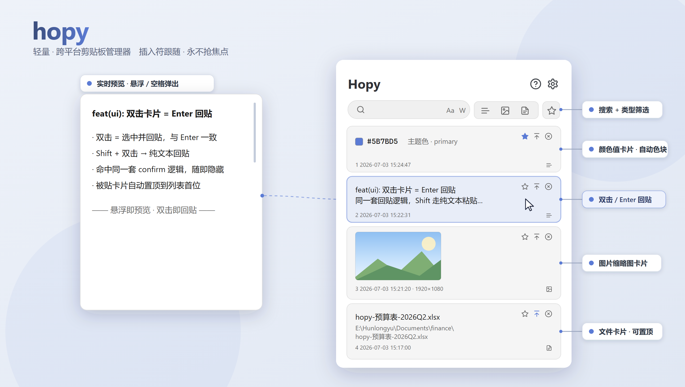
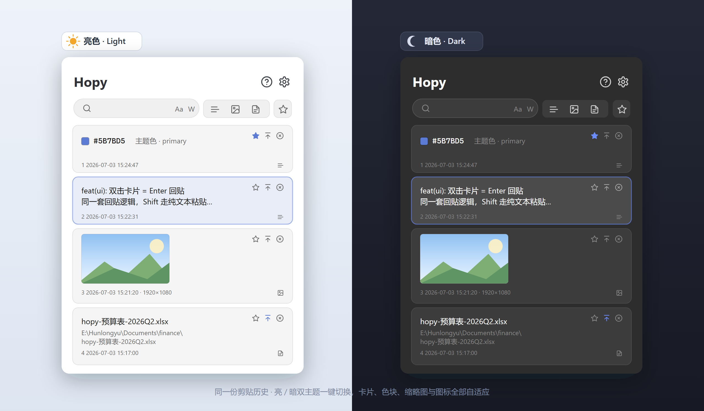

# hopy

轻量 · 跨平台**剪贴板管理器** —— Qt 6 (Widgets) + SQLite，在 Windows 下静态编译为**单个无依赖 exe**。
**插入符跟随、永不抢焦点**：窗口就在光标处弹出，回贴精准落回原位。

<p align="center">
  
</p>

## ✨ 功能特性

- **🎯 插入符跟随 · 不抢焦点** —— 窗口在编辑器**文本光标处**弹出；全程不夺取焦点，原窗口的插入符始终存活，因此回贴精准落回原光标位置。
- **🚀 全局热键唤起** —— 默认 `Alt + C`，可在设置里改成任意单键或组合键。
- **🎨 智能内容识别** —— 自动区分**文本 / 图片 / 文件**三类，各自渲染。
- **🌈 颜色值卡片** —— 自动识别 `#hex`（3/4/6/8 位）、`rgb()` / `rgba()`、裸 hex，行首直接画出色块。
- **🖼️ 图片缩略图** 与 **📄 文件名 / 路径** 卡片，一眼可辨。
- **👁️ 实时预览** —— 鼠标悬浮或按空格弹出预览；长文可滚动，鼠标侧键 `M4 / M5` 翻页。
- **🔍 搜索 + 筛选** —— 搜索支持大小写 `Aa`、全词 `W`；按类型 / 收藏快速过滤。
- **📌 置顶 · ⭐ 收藏 · 🗑️ 删除** —— 逐条管理常用内容。
- **⌨️ 全键盘 + 双击回贴** —— **双击卡片**或 `Enter` 回贴到原窗口，`Shift` 走纯文本，数字键 `1–5` 秒贴。
- **🌗 亮 / 暗双主题** —— 一键切换（默认暗色），卡片、色块、缩略图、图标全部自适应。
- **💾 SQLite 持久化** —— 历史落盘，重启不丢。
- **📦 静态单文件** —— 无 Qt DLL 依赖，拷贝即用。

## 🌗 亮 / 暗双主题

<p align="center">
  
</p>

## ⌨️ 快捷键

| 按键 | 功能 |
| --- | --- |
| `Alt + C` | 全局唤起窗口（默认，可自定义） |
| `双击卡片` / `Enter` | 回贴选中项到原窗口 |
| `Shift + Enter` | 以纯文本回贴 |
| `1 – 5` | 选取并回贴第 N 条 |
| `↑ / ↓` | 上一条 / 下一条 |
| `← / → / Tab` | 切换内容类型（筛选） |
| `/` | 聚焦搜索框 |
| `F` | 收藏 / 取消收藏 |
| `T` | 置顶 / 取消置顶 |
| `Delete` / `D` | 删除选中项 |
| `M4 / M5` | 预览翻页（侧键：M4 下翻 / M5 上翻） |
| `Esc` | 隐藏窗口 |

## 🔨 构建（Windows，静态单文件）

需要位于 `CMakePresets.json` 所引用前缀处的静态 Qt 6.11.1（MSVC 2026 x64），外加 Ninja 与 MSVC 2026 工具链。

```powershell
cmake --preset win-static-release
cmake --build --preset win-static-release
ctest --preset win-static-release
```

产物：`build/win-static-release/hopy.exe` —— 单个自包含可执行文件，不依赖任何 Qt DLL。

## 🧱 技术栈

- **UI**：Qt 6 Widgets（自绘 `RecordDelegate` 卡片，`QSS` 主题 + `QPalette` 调色板）
- **存储**：SQLite
- **平台层**：全局热键、低级输入钩子、插入符探测、前台窗口回贴（Windows / MSVC 2026 x64 静态链接），架构面向跨平台
- **构建**：CMake + Ninja + CMake Presets

> 展示图源文件为 [`docs/showcase.svg`](docs/showcase.svg) 与 [`docs/showcase-themes.svg`](docs/showcase-themes.svg)（矢量，可编辑），README 中引用的 PNG 由其渲染生成。
